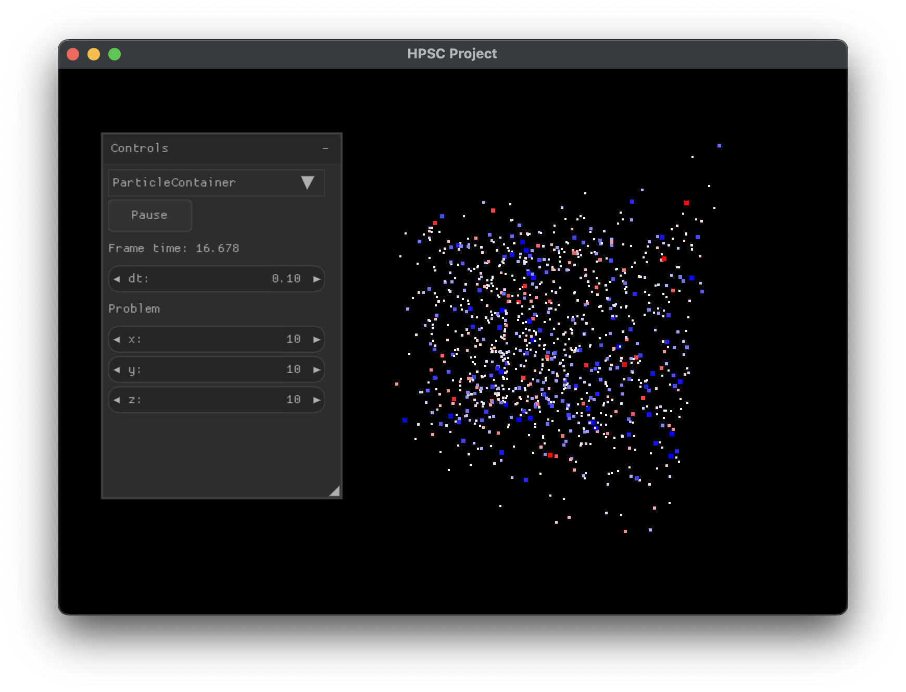

# MD Simulation Visualizer

This repository contains a basic visualization software for the molecular dynamics (MD) simulation we wrote in the 'High Performance Scientific Computing' course 2024/25 at the University of Hamburg.

## Overview


The software can be used to visualize the velocity and forces between particles in a MD simulation. The visualizer also provides a way to run the simulation in real time for a small problem size. Since the course focused mainly on the performance aspects of different data structures and algorithms used for such simulations, the tool can also be used to compare the performance impact of different particle container types.

The implemented container types are:
- ParticleContainer (using array of structures)
- SoAContainer (using structure of arrays)
- LinkedCellContainer (using cell lists)
- ParallelLCContainer (parallelized version of LinkedCellContainer)

## Implementation Details
Since we wrote the MD simulation in C++, but I wanted to use C for this visualizer, I wrote a [C wrapper API](include/mdlib.h). The simulation is provided as a dynamic library. I do it this way, because the code was part of the course exercise and I don't want to spoil some future participants :^) The 3D rendering part is done using `OpenGL 3.3` ([GLFW](https://github.com/glfw/glfw), [glad](https://github.com/Dav1dde/glad)). I used the single-header library [Nuklear](https://github.com/Immediate-Mode-UI/Nuklear) for the user interface.

Note that I only tested the code on MacOS, so don't expect it to run anywhere else. Also, this was basically a weekend project for me, which is why there are many simple features missing.

## Usage
Build the project using:
```
./build_mac.sh
```

Then, run it using:
```
./bin/mdviz
```